# Fine-tune and Integrate custom Phi-3 models with Prompt flow in Azure AI Foundry

This end-to-end (E2E) sample is based on the guide "[Fine-Tune and Integrate Custom Phi-3 Models with Prompt Flow in Azure AI Foundry](https://techcommunity.microsoft.com/t5/educator-developer-blog/fine-tune-and-integrate-custom-phi-3-models-with-prompt-flow-in/ba-p/4191726?WT.mc_id=aiml-137032-kinfeylo)" from the Microsoft Tech Community. It introduces the processes of fine-tuning, deploying, and integrating custom Phi-3 models with Prompt flow in Azure AI Foundry.
Unlike the E2E sample, "[Fine-Tune and Integrate Custom Phi-3 Models with Prompt Flow](./E2E_Phi-3-FineTuning_PromptFlow_Integration.md)", which involved running code locally, this tutorial focuses entirely on fine-tuning and integrating your model within the Azure AI / ML Studio.

## Overview

In this E2E sample, you will learn how to fine-tune the Phi-3 model and integrate it with Prompt flow in Azure AI Foundry. By leveraging Azure AI / ML Studio, you will establish a workflow for deploying and utilizing custom AI models. This E2E sample is divided into three scenarios:

**Scenario 1: Set up Azure resources and Prepare for fine-tuning**

**Scenario 2: Fine-tune the Phi-3 model and Deploy in Azure Machine Learning Studio**

**Scenario 3: Integrate with Prompt flow and Chat with your custom model in Azure AI Foundry**

Here is an overview of this E2E sample.

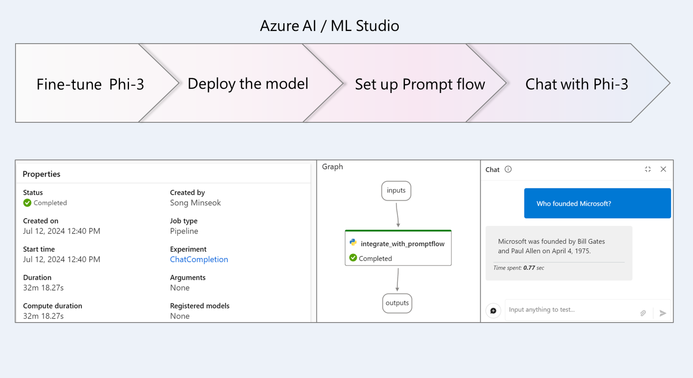

### Table of Contents

1. **[Scenario 1: Set up Azure resources and Prepare for fine-tuning](#scenario-1-set-up-azure-resources-and-prepare-for-fine-tuning)**
    - [Create an Azure Machine Learning Workspace](#create-an-azure-machine-learning-workspace)
    - [Request GPU quotas in Azure Subscription](#request-gpu-quotas-in-azure-subscription)
    - [Add role assignment](#add-role-assignment)
    - [Set up project](#set-up-project)
    - [Prepare dataset for fine-tuning](#prepare-dataset-for-fine-tuning)

1. **[Scenario 2: Fine-tune Phi-3 model and Deploy in Azure Machine Learning Studio](#scenario-2-fine-tune-phi-3-model-and-deploy-in-azure-machine-learning-studio)**
    - [Fine-tune the Phi-3 model](#fine-tune-the-phi-3-model)
    - [Deploy the fine-tuned Phi-3 model](#deploy-the-fine-tuned-phi-3-model)

1. **[Scenario 3: Integrate with Prompt flow and Chat with your custom model in Azure AI Foundry](#scenario-3-integrate-with-prompt-flow-and-chat-with-your-custom-model-in-azure-ai-studio)**
    - [Integrate the custom Phi-3 model with Prompt flow](#integrate-the-custom-phi-3-model-with-prompt-flow)
    - [Chat with your custom Phi-3 model](#chat-with-your-custom-phi-3-model)

## Scenario 1: Set up Azure resources and Prepare for fine-tuning

### Create an Azure Machine Learning Workspace

1. Type *azure machine learning* in the **search bar** at the top of the portal page and select **Azure Machine Learning** from the options that appear.

    

2. Select **+ Create** from the navigation menu.

3. Select **New workspace** from the navigation menu.

    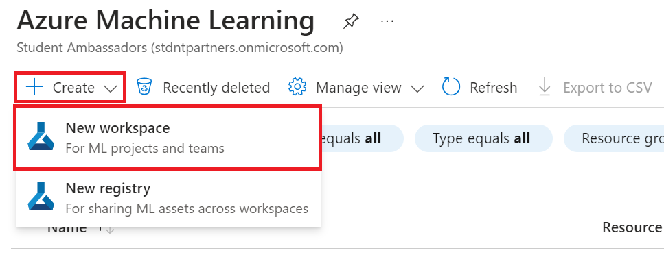

4. Perform the following tasks:

    - Select your Azure **Subscription**.
    - Select the **Resource group** to use (create a new one if needed).
    - Enter **Workspace Name**. It must be a unique value.
    - Select the **Region** you'd like to use.
    - Select the **Storage account** to use (create a new one if needed).
    - Select the **Key vault** to use (create a new one if needed).
    - Select the **Application insights** to use (create a new one if needed).
    - Select the **Container registry** to use (create a new one if needed).

    

5. Select **Review + Create**.

6. Select **Create**.

### Request GPU quotas in Azure Subscription

In this tutorial, you will learn how to fine-tune and deploy a Phi-3 model, using GPUs. For fine-tuning, you will use the *Standard_NC24ads_A100_v4* GPU, which requires a quota request. For deployment, you will use the *Standard_NC6s_v3* GPU, which also requires a quota request.

> [!NOTE]
>
> Only Pay-As-You-Go subscriptions (the standard subscription type) are eligible for GPU allocation; benefit subscriptions are not currently supported.
>

1. Visit [Azure ML Studio](https://ml.azure.com/home?wt.mc_id=studentamb_279723).

1. Perform the following tasks to request *Standard NCADSA100v4 Family* quota:

    - Select **Quota** from the left side tab.
    - Select the **Virtual machine family** to use. For example, select **Standard NCADSA100v4 Family Cluster Dedicated vCPUs**, which includes the *Standard_NC24ads_A100_v4* GPU.
    - Select the **Request quota** from the navigation menu.

        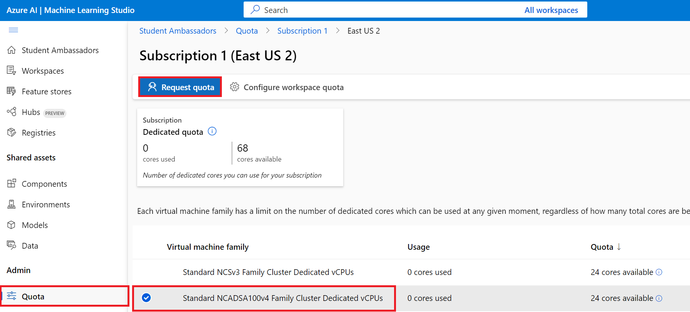

    - Inside the Request quota page, enter the **New cores limit** you'd like to use. For example, 24.
    - Inside the Request quota page, select **Submit** to request the GPU quota.

1. Perform the following tasks to request *Standard NCSv3 Family* quota:

    - Select **Quota** from the left side tab.
    - Select the **Virtual machine family** to use. For example, select **Standard NCSv3 Family Cluster Dedicated vCPUs**, which includes the *Standard_NC6s_v3* GPU.
    - Select the **Request quota** from the navigation menu.
    - Inside the Request quota page, enter the **New cores limit** you'd like to use. For example, 24.
    - Inside the Request quota page, select **Submit** to request the GPU quota.

### Add role assignment

To fine-tune and deploy your models, you must first create a User Assigned Managed Identity (UAI) and assign it the appropriate permissions. This UAI will be used for authentication during deployment

#### Create User Assigned Managed Identity(UAI)

1. Type *managed identities* in the **search bar** at the top of the portal page and select **Managed Identities** from the options that appear.

    

1. Select **+ Create**.

    

1. Perform the following tasks:

    - Select your Azure **Subscription**.
    - Select the **Resource group** to use (create a new one if needed).
    - Select the **Region** you'd like to use.
    - Enter the **Name**. It must be a unique value.

    

1. Select **Review + create**.

1. Select **+ Create**.

#### Add Contributor role assignment to Managed Identity

1. Navigate to the Managed Identity resource that you created.

1. Select **Azure role assignments** from the left side tab.

1. Select **+Add role assignment** from the navigation menu.

1. Inside Add role assignment page, Perform the following tasks:
    - Select the **Scope** to **Resource group**.
    - Select your Azure **Subscription**.
    - Select the **Resource group** to use.
    - Select the **Role** to **Contributor**.

    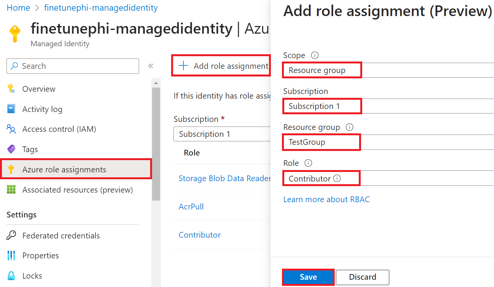

2. Select **Save**.

#### Add Storage Blob Data Reader role assignment to Managed Identity

1. Type *storage accounts* in the **search bar** at the top of the portal page and select **Storage accounts** from the options that appear.

    

1. Select the storage account that associated with the Azure Machine Learning workspace that you created. For example, *finetunephistorage*.

1. Perform the following tasks to navigate to Add role assignment page:

    - Navigate to the Azure Storage account that you created.
    - Select **Access Control (IAM)** from the left side tab.
    - Select **+ Add** from the navigation menu.
    - Select **Add role assignment** from the navigation menu.

    

1. Inside Add role assignment page, Perform the following tasks:

    - Inside the Role page, type *Storage Blob Data Reader* in the **search bar** and select **Storage Blob Data Reader** from the options that appear.
    - Inside the Role page, select **Next**.
    - Inside the Members page, select **Assign access to** **Managed identity**.
    - Inside the Members page, select **+ Select members**.
    - Inside Select managed identities page, select your Azure **Subscription**.
    - Inside Select managed identities page, select the **Managed identity** to **Manage Identity**.
    - Inside Select managed identities page, select the Manage Identity that you created. For example, *finetunephi-managedidentity*.
    - Inside Select managed identities page, select **Select**.

    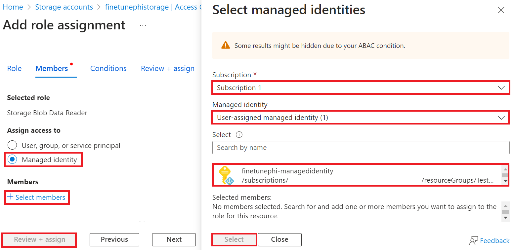

1. Select **Review + assign**.

#### Add AcrPull role assignment to Managed Identity

1. Type *container registries* in the **search bar** at the top of the portal page and select **Container registries** from the options that appear.

    

1. Select the container registry that associated with the Azure Machine Learning workspace. For example, *finetunephicontainerregistry*

1. Perform the following tasks to navigate to Add role assignment page:

    - Select **Access Control (IAM)** from the left side tab.
    - Select **+ Add** from the navigation menu.
    - Select **Add role assignment** from the navigation menu.

1. Inside Add role assignment page, Perform the following tasks:

    - Inside the Role page, Type *AcrPull* in the **search bar** and select **AcrPull** from the options that appear.
    - Inside the Role page, select **Next**.
    - Inside the Members page, select **Assign access to** **Managed identity**.
    - Inside the Members page, select **+ Select members**.
    - Inside Select managed identities page, select your Azure **Subscription**.
    - Inside Select managed identities page, select the **Managed identity** to **Manage Identity**.
    - Inside Select managed identities page, select the Manage Identity that you created. For example, *finetunephi-managedidentity*.
    - Inside Select managed identities page, select **Select**.
    - Select **Review + assign**.

### Set up project

To download the datasets needed for fine-tuning, you will set up a local environment.

In this exercise, you will

- Create a folder to work inside it.
- Create a virtual environment.
- Install the required packages.
- Create a *download_dataset.py* file to download the dataset.

#### Create a folder to work inside it

1. Open a terminal window and type the following command to create a folder named *finetune-phi* in the default path.

    ```console
    mkdir finetune-phi
    ```

2. Type the following command inside your terminal to navigate to the *finetune-phi* folder you created.

    ```console
    cd finetune-phi
    ```

#### Create a virtual environment

1. Type the following command inside your terminal to create a virtual environment named *.venv*.

    ```console
    python -m venv .venv
    ```

2. Type the following command inside your terminal to activate the virtual environment.

    ```console
    .venv\Scripts\activate.bat
    ```

> [!NOTE]
> If it worked, you should see *(.venv)* before the command prompt.

#### Install the required packages

1. Type the following commands inside your terminal to install the required packages.

    ```console
    pip install datasets==2.19.1
    ```

#### Create `donload_dataset.py`

> [!NOTE]
> Complete folder structure:
>
> ```text
> └── YourUserName
> .    └── finetune-phi
> .        └── download_dataset.py
> ```

1. Open **Visual Studio Code**.

1. Select **File** from the menu bar.

1. Select **Open Folder**.

1. Select the *finetune-phi* folder that you created, which is located at *C:\Users\yourUserName\finetune-phi*.

    

1. In the left pane of Visual Studio Code, right-click and select **New File** to create a new file named *download_dataset.py*.

    

### Prepare dataset for fine-tuning

In this exercise, you will run the *download_dataset.py* file to download the *ultrachat_200k* datasets to your local environment. You will then use this datasets to fine-tune the Phi-3 model in Azure Machine Learning.

In this exercise, you will:

- Add code to the *download_dataset.py* file to download the datasets.
- Run the *download_dataset.py* file to download datasets to your local environment.

#### Download your dataset using *download_dataset.py*

1. Open the *download_dataset.py* file in Visual Studio Code.

1. Add the following code into *download_dataset.py* file.

    ```python
    import json
    import os
    from datasets import load_dataset

    def load_and_split_dataset(dataset_name, config_name, split_ratio):
        """
        Load and split a dataset.
        """
        # Load the dataset with the specified name, configuration, and split ratio
        dataset = load_dataset(dataset_name, config_name, split=split_ratio)
        print(f"Original dataset size: {len(dataset)}")
        
        # Split the dataset into train and test sets (80% train, 20% test)
        split_dataset = dataset.train_test_split(test_size=0.2)
        print(f"Train dataset size: {len(split_dataset['train'])}")
        print(f"Test dataset size: {len(split_dataset['test'])}")
        
        return split_dataset

    def save_dataset_to_jsonl(dataset, filepath):
        """
        Save a dataset to a JSONL file.
        """
        # Create the directory if it does not exist
        os.makedirs(os.path.dirname(filepath), exist_ok=True)
        
        # Open the file in write mode
        with open(filepath, 'w', encoding='utf-8') as f:
            # Iterate over each record in the dataset
            for record in dataset:
                # Dump the record as a JSON object and write it to the file
                json.dump(record, f)
                # Write a newline character to separate records
                f.write('\n')
        
        print(f"Dataset saved to {filepath}")

    def main():
        """
        Main function to load, split, and save the dataset.
        """
        # Load and split the ULTRACHAT_200k dataset with a specific configuration and split ratio
        dataset = load_and_split_dataset("HuggingFaceH4/ultrachat_200k", 'default', 'train_sft[:1%]')
        
        # Extract the train and test datasets from the split
        train_dataset = dataset['train']
        test_dataset = dataset['test']

        # Save the train dataset to a JSONL file
        save_dataset_to_jsonl(train_dataset, "data/train_data.jsonl")
        
        # Save the test dataset to a separate JSONL file
        save_dataset_to_jsonl(test_dataset, "data/test_data.jsonl")

    if __name__ == "__main__":
        main()

    ```

1. Type the following command inside your terminal to run the script and download the dataset to your local environment.

    ```console
    python download_dataset.py
    ```

1. Verify that the datasets were saved successfully to your local *finetune-phi/data* directory.

> [!NOTE]
>
> #### Note on dataset size and fine-tuning time
>
> In this tutorial, you use only 1% of the dataset (`split='train[:1%]'`). This significantly reduces the amount of data, speeding up both the upload and fine-tuning processes. You can adjust the percentage to find the right balance between training time and model performance. Using a smaller subset of the dataset reduces the time required for fine-tuning, making the process more manageable for a tutorial.

## Scenario 2: Fine-tune Phi-3 model and Deploy in Azure Machine Learning Studio

### Fine-tune the Phi-3 model

In this exercise, you will fine-tune the Phi-3 model in Azure Machine Learning Studio.

In this exercise, you will:

- Create computer cluster for fine-tuning.
- Fine-tune the Phi-3 model in Azure Machine Learning Studio.

#### Create computer cluster for fine-tuning

1. Visit [Azure ML Studio](https://ml.azure.com/home?wt.mc_id=studentamb_279723).

1. Select **Compute** from the left side tab.

1. Select **Compute clusters** from the navigation menu.

1. Select **+ New**.

    

1. Perform the following tasks:

    - Select the **Region** you'd like to use.
    - Select the **Virtual machine tier** to **Dedicated**.
    - Select the **Virtual machine type** to **GPU**.
    - Select the **Virtual machine size** filter to **Select from all options**.
    - Select the **Virtual machine size** to **Standard_NC24ads_A100_v4**.

    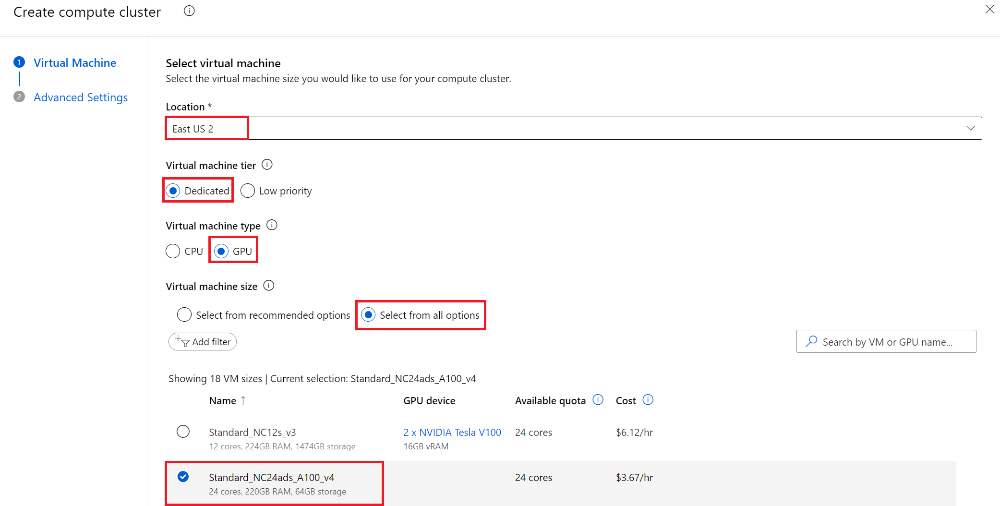

1. Select **Next**.

1. Perform the following tasks:

    - Enter **Compute name**. It must be a unique value.
    - Select the **Minimum number of nodes** to **0**.
    - Select the **Maximum number of nodes** to **1**.
    - Select the **Idle seconds before scale down** to **120**.

    

1. Select **Create**.

#### Fine-tune the Phi-3 model

1. Visit [Azure ML Studio](https://ml.azure.com/home?wt.mc_id=studentamb_279723).

1. Select the Azure Macnine Learning workspace that you created.

    

1. Perform the following tasks:

    - Select **Model catalog** from the left side tab.
    - Type *phi-3-mini-4k* in the **search bar** and select **Phi-3-mini-4k-instruct** from the options that appear.

    

1. Select **Fine-tune** from the navigation menu.

    

1. Perform the following tasks:

    - Select **Select task type** to **Chat completion**.
    - Select **+ Select data** to upload **Traning data**.
    - Select the Validation data upload type to **Provide different validation data**.
    - Select **+ Select data** to upload **Validation data**.

    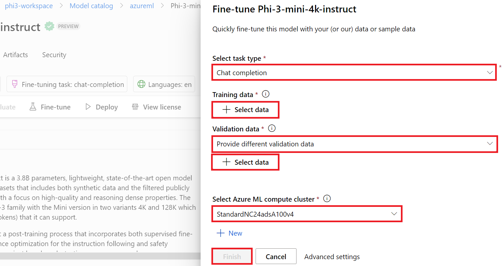

    > [!TIP]
    >
    > You can select **Advanced settings** to customize configurations such as **learning_rate** and **lr_scheduler_type** to optimize the fine-tuning process according to your specific needs.

1. Select **Finish**.

1. In this exercise, you successfully fine-tuned the Phi-3 model using Azure Machine Learning. Please note that the fine-tuning process can take a considerable amount of time. After running the fine-tuning job, you need to wait for it to complete. You can monitor the status of the fine-tuning job by navigating to the Jobs tab on the left side of your Azure Machine Learning Workspace. In the next series, you will deploy the fine-tuned model and integrate it with Prompt flow.

    

### Deploy the fine-tuned Phi-3 model

To integrate the fine-tuned Phi-3 model with Prompt flow, you need to deploy the model to make it accessible for real-time inference. This process involves registering the model, creating an online endpoint, and deploying the model.

In this exercise, you will:

- Register the fine-tuned model in the Azure Machine Learning workspace.
- Create an online endpoint.
- Deploy the registered fine-tuned Phi-3 model.

#### Register the fine-tuned model

1. Visit [Azure ML Studio](https://ml.azure.com/home?wt.mc_id=studentamb_279723).

1. Select the Azure Macnine Learning workspace that you created.

    

1. Select **Models** from the left side tab.
1. Select **+ Register**.
1. Select **From a job output**.

    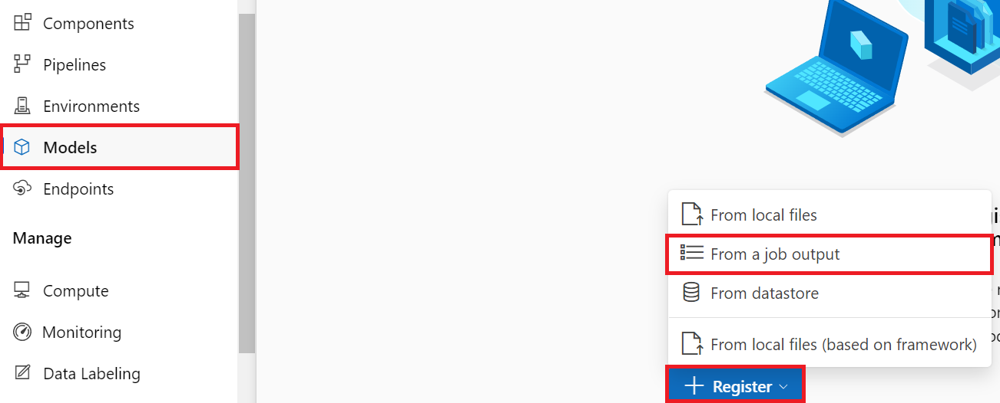

1. Select the job that you created.

    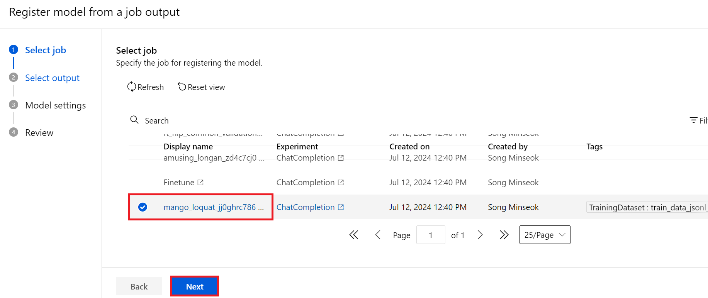

1. Select **Next**.

1. Select **Model type** to **MLflow**.

1. Ensure that **Job output** is selected; it should be automatically selected.

    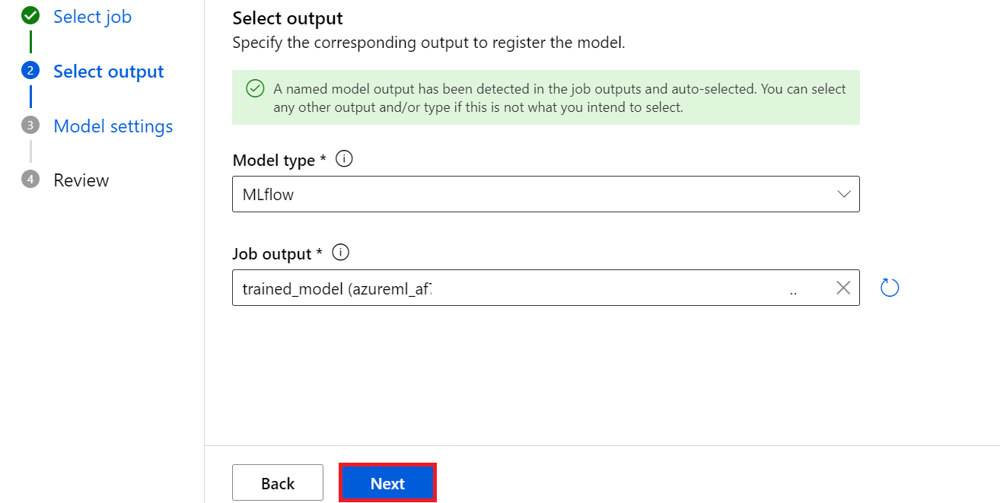

2. Select **Next**.

3. Select **Register**.

    

4. You can view your registered model by navigating to the **Models** menu from the left side tab.

    

#### Deploy the fine-tuned model

1. Navigate to the Azure Macnine Learning workspace that you created.

1. Select **Endpoints** from the left side tab.

1. Select **Real-time endpoints** from the navigation menu.

    

1. Select **Create**.

1. select the registered model that you created.

    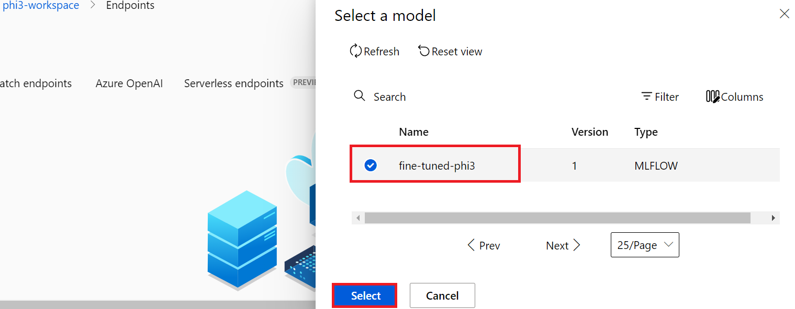

1. Select **Select**.

1. Perform the following tasks:

    - Select **Virtual machine** to *Standard_NC6s_v3*.
    - Select the **Instance count** you'd like to use. For example, *1*.
    - Select the **Endpoint** to **New** to create an endpoint.
    - Enter **Endpoint name**. It must be a unique value.
    - Enter **Deployment name**. It must be a unique value.

    

1. Select **Deploy**.

> [!WARNING]
> To avoid additional charges to your account, make sure to delete the created endpoint in the Azure Machine Learning workspace.
>

#### Check deployment status in Azure Machine Learning Workspace

1. Navigate to Azure Machine Learning workspace that you created.

1. Select **Endpoints** from the left side tab.

1. Select the endpoint that you created.

    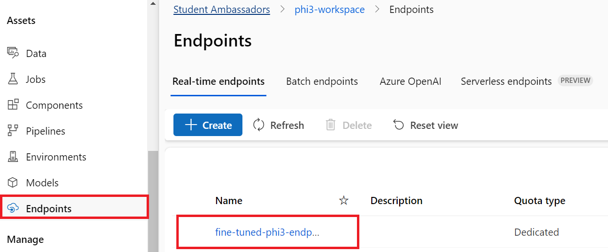

1. On this page, you can manage the endpoints during the deployment process.

> [!NOTE]
> Once the deployment is complete, ensure that **Live traffic** is set to **100%**. If it is not, select **Update traffic** to adjust the traffic settings. Note that you cannot test the model if the traffic is set to 0%.
>
> 
>

## Scenario 3: Integrate with Prompt flow and Chat with your custom model in Azure AI Foundry

### Integrate the custom Phi-3 model with Prompt flow

After successfully deploying your fine-tuned model, you can now integrate it with Prompt Flow to use your model in real-time applications, enabling a variety of interactive tasks with your custom Phi-3 model.

In this exercise, you will:

- Create Azure AI Foundry Hub.
- Create Azure AI Foundry Project.
- Create Prompt flow.
- Add a custom connection for the fine-tuned Phi-3 model.
- Set up Prompt flow to chat with your custom Phi-3 model

> [!NOTE]
> You can also integrate with Promptflow using Azure ML Studio. The same integration process can be applied to Azure ML Studio.

#### Create Azure AI Foundry Hub

You need to create a Hub before creating the Project. A Hub acts like a Resource Group, allowing you to organize and manage multiple Projects within Azure AI Foundry.

1. Visit [Azure AI Foundry](https://ai.azure.com/?WT.mc_id=aiml-137032-kinfeylo).

1. Select **All hubs** from the left side tab.

1. Select **+ New hub** from the navigation menu.

    

1. Perform the following tasks:

    - Enter **Hub name**. It must be a unique value.
    - Select your Azure **Subscription**.
    - Select the **Resource group** to use (create a new one if needed).
    - Select the **Location** you'd like to use.
    - Select the **Connect Azure AI Services** to use (create a new one if needed).
    - Select **Connect Azure AI Search** to **Skip connecting**.

    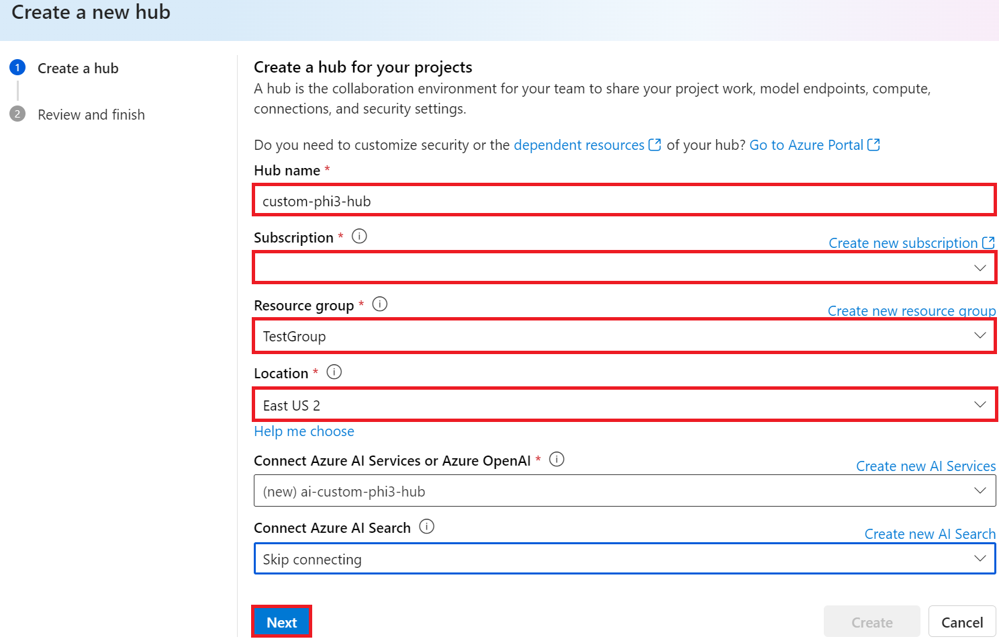

1. Select **Next**.

#### Create Azure AI Foundry Project

1. In the Hub that you created, select **All projects** from the left side tab.

1. Select **+ New project** from the navigation menu.

    

1. Enter **Project name**. It must be a unique value.

    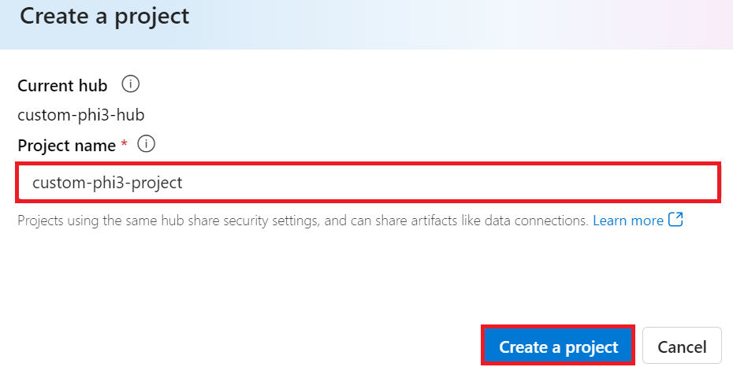

1. Select **Create a project**.

#### Add a custom connection for the fine-tuned Phi-3 model

To integrate your custom Phi-3 model with Prompt flow, you need to save the model's endpoint and key in a custom connection. This setup ensures access to your custom Phi-3 model in Prompt flow.

#### Set api key and endpoint uri of the fine-tuned Phi-3 model

1. Visit [Azure ML Studio](https://ml.azure.com/home?WT.mc_id=aiml-137032-kinfeylo).

1. Navigate to the Azure Machine learning workspace that you created.

1. Select **Endpoints** from the left side tab.

    

1. Select endpoint that you created.

    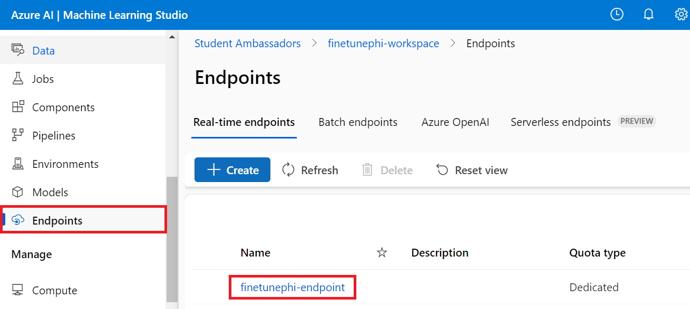

1. Select **Consume** from the navigation menu.

1. Copy your **REST endpoint** and **Primary key**.

    

#### Add the Custom Connection

1. Visit [Azure AI Foundry](https://ai.azure.com/?WT.mc_id=aiml-137032-kinfeylo).

1. Navigate to the Azure AI Foundry project that you created.

1. In the Project that you created, select **Settings** from the left side tab.

1. Select **+ New connection**.

    

1. Select **Custom keys** from the navigation menu.

    

1. Perform the following tasks:

    - Select **+ Add key value pairs**.
    - For the key name, enter **endpoint** and paste the endpoint you copied from Azure ML Studio into the value field.
    - Select **+ Add key value pairs** again.
    - For the key name, enter **key** and paste the key you copied from Azure ML Studio into the value field.
    - After adding the keys, select **is secret** to prevent the key from being exposed.

    

1. Select **Add connection**.

#### Create Prompt flow

You have added a custom connection in Azure AI Foundry. Now, let's create a Prompt flow using the following steps. Then, you will connect this Prompt flow to the custom connection so that you can use the fine-tuned model within the Prompt flow.

1. Navigate to the Azure AI Foundry project that you created.

1. Select **Prompt flow** from the left side tab.

1. Select **+ Create** from the navigation menu.

    

1. Select **Chat flow** from the navigation menu.

    

1. Enter **Folder name** to use.

    

2. Select **Create**.

#### Set up Prompt flow to chat with your custom Phi-3 model

You need to integrate the fine-tuned Phi-3 model into a Prompt flow. However, the existing Prompt flow provided is not designed for this purpose. Therefore, you must redesign the Prompt flow to enable the integration of the custom model.

1. In the Prompt flow, perform the following tasks to rebuild the existing flow:

    - Select **Raw file mode**.
    - Delete all existing code in the *flow.dag.yml* file.
    - Add the following code to *flow.dag.yml* file.

        ```yml
        inputs:
          input_data:
            type: string
            default: "Who founded Microsoft?"

        outputs:
          answer:
            type: string
            reference: ${integrate_with_promptflow.output}

        nodes:
        - name: integrate_with_promptflow
          type: python
          source:
            type: code
            path: integrate_with_promptflow.py
          inputs:
            input_data: ${inputs.input_data}
        ```

    - Select **Save**.

    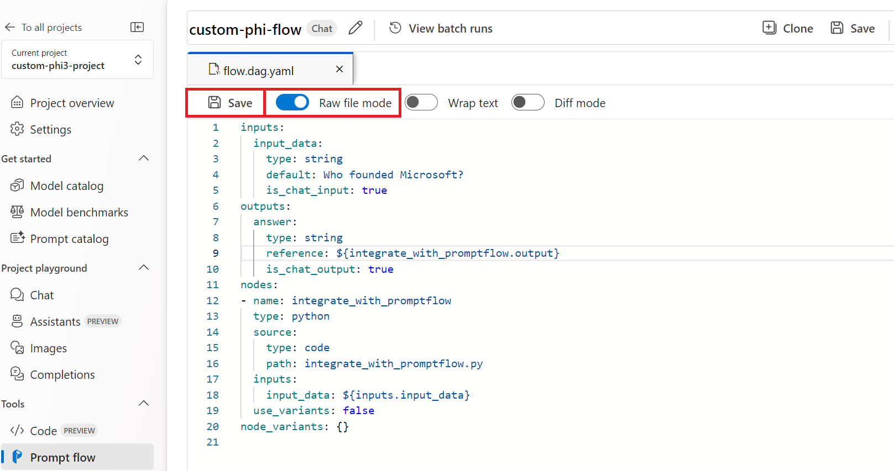

1. Add the following code to *integrate_with_promptflow.py* file to use the custom Phi-3 model in Prompt flow.

    ```python
    import logging
    import requests
    from promptflow import tool
    from promptflow.connections import CustomConnection

    # Logging setup
    logging.basicConfig(
        format="%(asctime)s - %(levelname)s - %(name)s - %(message)s",
        datefmt="%Y-%m-%d %H:%M:%S",
        level=logging.DEBUG
    )
    logger = logging.getLogger(__name__)

    def query_phi3_model(input_data: str, connection: CustomConnection) -> str:
        """
        Send a request to the Phi-3 model endpoint with the given input data using Custom Connection.
        """

        # "connection" is the name of the Custom Connection, "endpoint", "key" are the keys in the Custom Connection
        endpoint_url = connection.endpoint
        api_key = connection.key

        headers = {
            "Content-Type": "application/json",
            "Authorization": f"Bearer {api_key}"
        }
        data = {
            "input_data": {
                "input_string": [
                    {"role": "user", "content": input_data}
                ],
                "parameters": {
                    "temperature": 0.7,
                    "max_new_tokens": 128
                }
            }
        }
        try:
            response = requests.post(endpoint_url, json=data, headers=headers)
            response.raise_for_status()
            
            # Log the full JSON response
            logger.debug(f"Full JSON response: {response.json()}")

            result = response.json()["output"]
            logger.info("Successfully received response from Azure ML Endpoint.")
            return result
        except requests.exceptions.RequestException as e:
            logger.error(f"Error querying Azure ML Endpoint: {e}")
            raise

    @tool
    def my_python_tool(input_data: str, connection: CustomConnection) -> str:
        """
        Tool function to process input data and query the Phi-3 model.
        """
        return query_phi3_model(input_data, connection)

    ```

    

> [!NOTE]
> For more detailed information on using Prompt flow in Azure AI Foundry, you can refer to [Prompt flow in Azure AI Foundry](https://learn.microsoft.com/azure/ai-studio/how-to/prompt-flow).

1. Select **Chat input**, **Chat output** to enable chat with your model.

    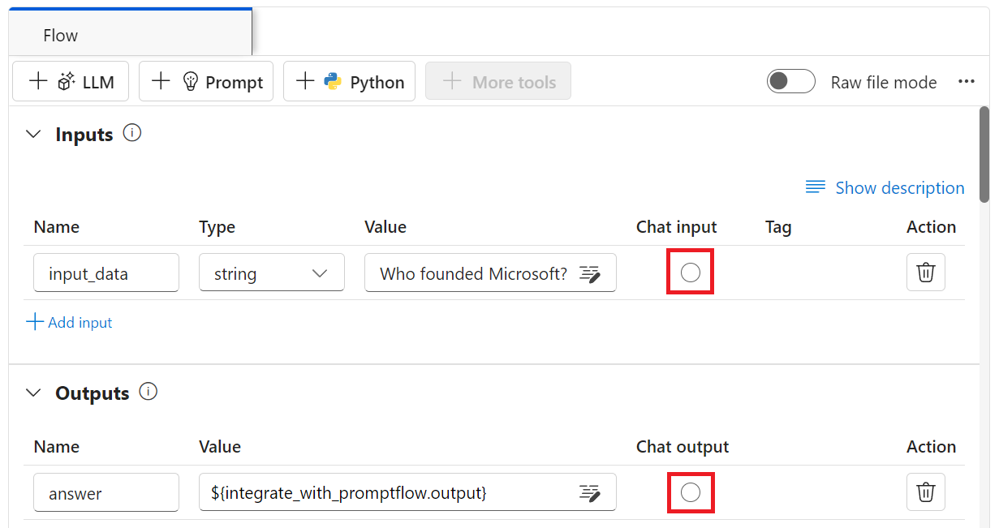

1. Now you are ready to chat with your custom Phi-3 model. In the next exercise, you will learn how to start Prompt flow and use it to chat with your fine-tuned Phi-3 model.

> [!NOTE]
>
> The rebuilt flow should look like the image below:
>
> 
>

### Chat with your custom Phi-3 model

Now that you have fine-tuned and integrated your custom Phi-3 model with Prompt flow, you are ready to start interacting with it. This exercise will guide you through the process of setting up and initiating a chat with your model using Prompt flow. By following these steps, you will be able to fully utilize the capabilities of your fine-tuned Phi-3 model for various tasks and conversations.

- Chat with your custom Phi-3 model using Prompt flow.

#### Start Prompt flow

1. Select **Start compute sessions** to start Prompt flow.

    

1. Select **Validate and parse input** to renew parameters.

    

1. Select the **Value** of the **connection** to the custom connection you created. For example, *connection*.

    

#### Chat with your custom model

1. Select **Chat**.

    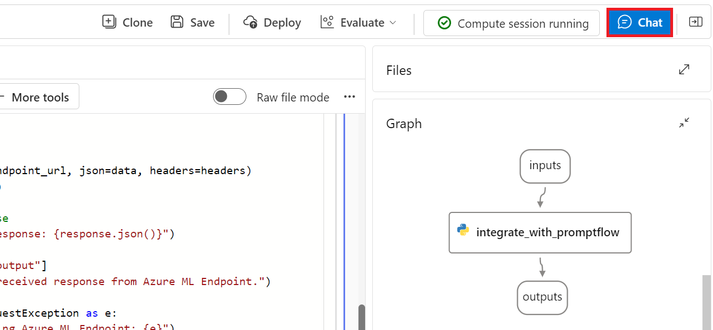

1. Here's an example of the results: Now you can chat with your custom Phi-3 model. It is recommended to ask questions based on the data used for fine-tuning.

    
