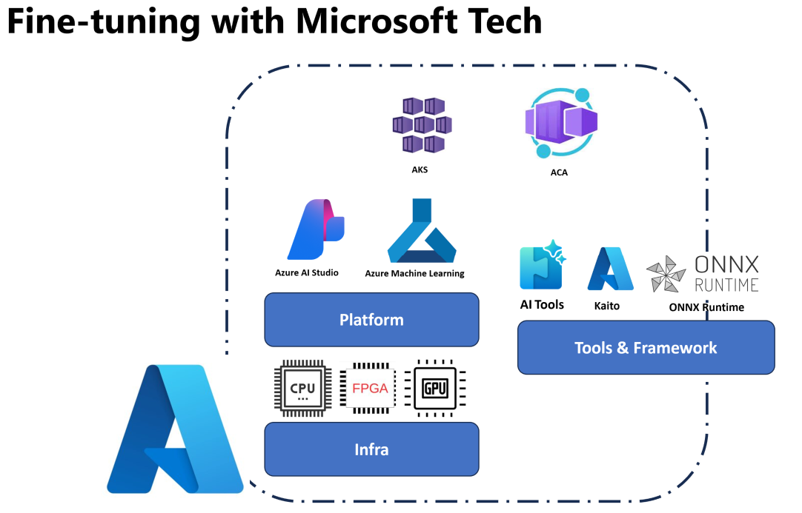
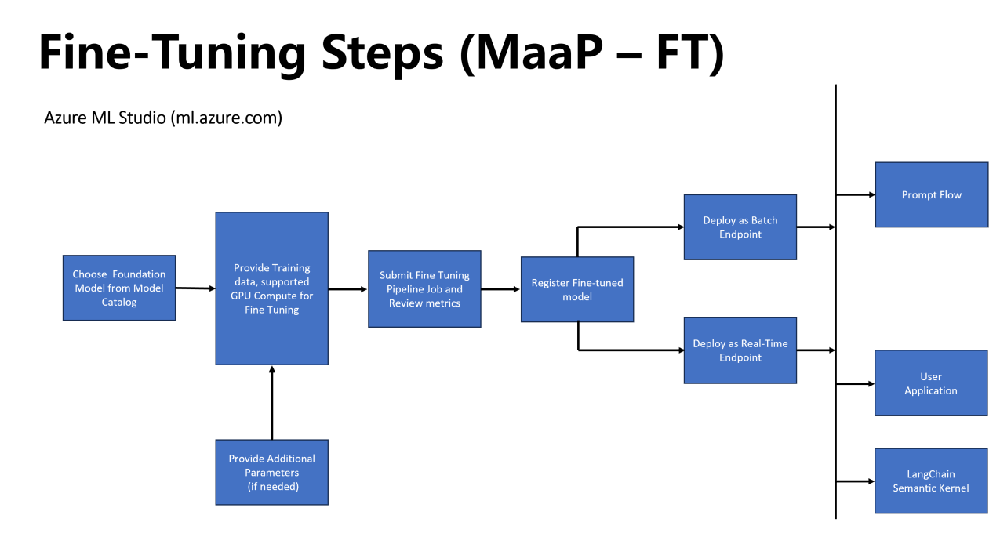
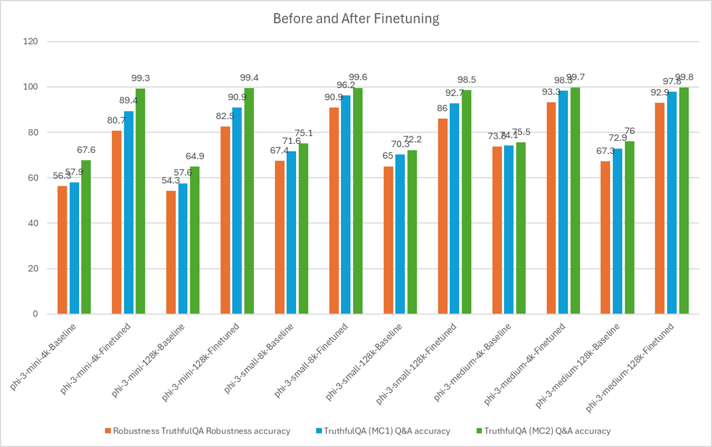

## Fine Tuning Scenarios

**Platform** This includes various technologies such as Azure AI Foundry, Azure Machine Learning, AI Tools, Kaito, and ONNX Runtime. 

**Infrastructure** This includes the CPU and FPGA, which are essential for the fine-tuning process. Let me show you the icons for each of these technologies.

**Tools & Framework** This includes ONNX Runtime and ONNX Runtime. Let me show you the icons for each of these technologies.
[Insert icons for ONNX Runtime and ONNX Runtime]

The fine-tuning process with Microsoft technologies involves various components and tools. By understanding and utilizing these technologies, we can effectively fine-tune our applications and create better solutions. 

## Model as Service

Fine-tune the model using hosted fine-tuning, without the need to create and manage compute.

Serverless fine-tuning is available for Phi-3-mini and Phi-3-medium models, enabling developers to quickly and easily customize the models for cloud and edge scenarios without having to arrange for compute. We have also announced that, Phi-3-small, is now available through our Models-as-a-Service offering so developers can quickly and easily get started with AI development without having to manage underlying infrastructure.

[Fine Tuning Sample](https://github.com/microsoft/Phi-3CookBook/blob/main/md/04.Fine-tuning/FineTuning_AIFoundry.md)
## Model as a Platform 

Users manage their own compute in order to Fine-tune their models.

[Fine Tuning Sample](https://github.com/Azure/azureml-examples/blob/main/sdk/python/foundation-models/system/finetune/chat-completion/chat-completion.ipynb)

## Fine Tuning Scenarios 

| | | | | | | |
|-|-|-|-|-|-|-|
|Scenario|LoRA|QLoRA|PEFT|DeepSpeed|ZeRO|DORA|
|Adapting pre-trained LLMs to specific tasks or domains|Yes|Yes|Yes|Yes|Yes|Yes|
|Fine-tuning for NLP tasks such as text classification, named entity recognition, and machine translation|Yes|Yes|Yes|Yes|Yes|Yes|
|Fine-tuning for QA tasks|Yes|Yes|Yes|Yes|Yes|Yes|
|Fine-tuning for generating human-like responses in chatbots|Yes|Yes|Yes|Yes|Yes|Yes|
|Fine-tuning for generating music, art, or other forms of creativity|Yes|Yes|Yes|Yes|Yes|Yes|
|Reducing computational and financial costs|Yes|Yes|No|Yes|Yes|No|
|Reducing memory usage|No|Yes|No|Yes|Yes|Yes|
|Using fewer parameters for efficient finetuning|No|Yes|Yes|No|No|Yes|
|Memory-efficient form of data parallelism that gives access to the aggregate GPU memory of all the GPU devices available|No|No|No|Yes|Yes|Yes|

## Fine Tuning Performance Examples

